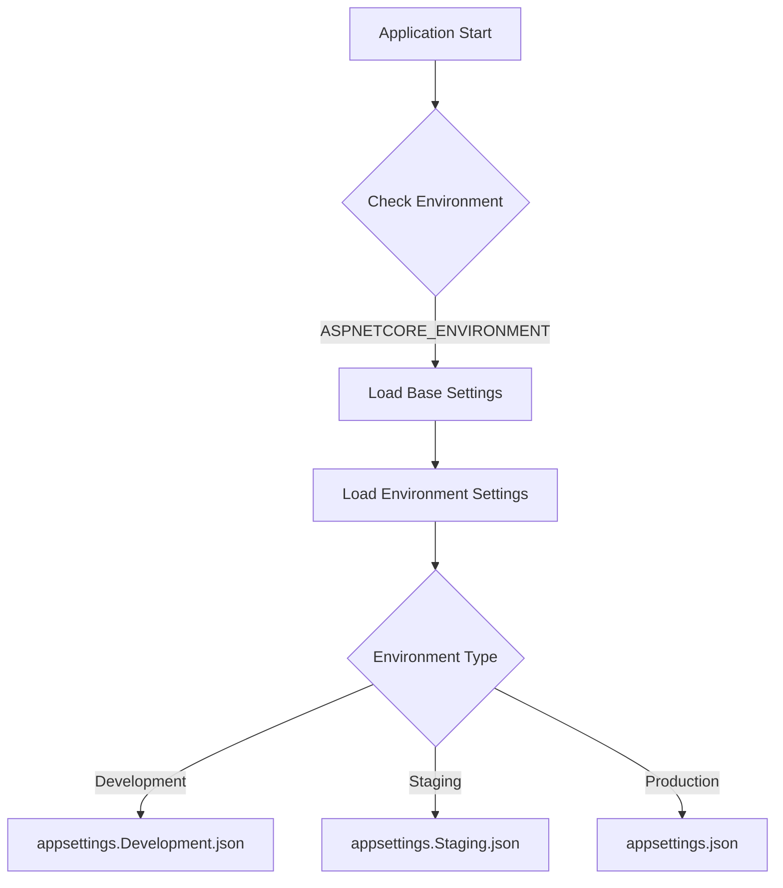

# ASP.NET Core Configuration Guide

## Table of Contents
- [Overview](#overview)
- [Configuration Files](#configuration-files)
- [Environment-Based Configuration](#environment-based-configuration)
- [Accessing Configuration Values](#accessing-configuration-values)
- [Implementation Example](#implementation-example)

## Overview

ASP.NET Core uses a flexible configuration system based on key-value pairs. These configurations can be loaded from multiple sources and can be environment-specific.

## Configuration Files

| File Name | Purpose | Environment |
|-----------|---------|-------------|
| appsettings.json | Base configuration file with default settings | All |
| appsettings.Development.json | Development-specific settings | Development |
| appsettings.Staging.json | Staging-specific settings | Staging |
| appsettings.Production.json | Production-specific settings | Production |

### Common Configuration Settings
- Connection Strings
- Logging Levels
- Application-specific settings
- Third-party service configurations

```json
{
    "ConnectionStrings": {
        "DefaultConnection": "Server=...;Database=...;"
    },
    "Logging": {
        "LogLevel": {
            "Default": "Information"
        }
    },
    "MyKey": "MyValue"
}
```

## Environment-Based Configuration



### Environment Detection
- Located in `Properties/launchSettings.json`
- Controlled by `ASPNETCORE_ENVIRONMENT` variable
- Common values:
  - Development
  - Staging
  - Production

## Accessing Configuration Values

### Using IConfiguration Interface

```csharp
// Basic injection
private readonly IConfiguration _configuration;

public MyClass(IConfiguration configuration)
{
    _configuration = configuration;
}
```

### Reading Configuration Values

| Access Method | Example | Use Case |
|--------------|---------|----------|
| Direct Access | `_configuration["MyKey"]` | Simple key-value |
| Nested Access | `_configuration["ConnectionStrings:DefaultConnection"]` | Nested objects |
| Helper Method | `_configuration.GetConnectionString("DefaultConnection")` | Connection strings |

### Configuration Access Examples

```csharp
// Simple value
var simpleValue = _configuration["MyKey"];

// Nested value
var logLevel = _configuration["Logging:LogLevel:Default"];

// Connection string
var connString = _configuration.GetConnectionString("DefaultConnection");
```

## Implementation Example

```csharp
[Route("[controller]")]
[ApiController]
public class AuthController : ControllerBase
{
    private readonly IAuthService _authService;
    private readonly IConfiguration _configuration;

    public AuthController(IAuthService authService, IConfiguration configuration)
    {
        _authService = authService;
        _configuration = configuration;
    }

    [HttpGet("Test")]
    public IActionResult Test()
    {
        var config = new
        {
            MyKey = _configuration["MyKey"]
        };
        return Ok(config);
    }

    [HttpPost("")]
    public async Task<IActionResult> LoginAsync(
        LoginRequest request, 
        CancellationToken cancellationToken)
    {
        var authResult = await _authService.GetTokenAsync(
            request.Email,
            request.Password,
            cancellationToken);

        return authResult is null 
            ? BadRequest("Invalid Email or Password") 
            : Ok(authResult);
    }
}
```

## Best Practices

1. **Environment-Specific Settings**
   - Keep sensitive data in environment-specific files
   - Use different connection strings per environment
   - Override settings as needed for each environment

2. **Configuration Organization**
   - Group related settings together
   - Use meaningful section names
   - Keep consistent naming conventions

3. **Security Considerations**
   - Never commit sensitive data to source control
   - Use user secrets in development
   - Use secure configuration providers in production

---

This guide provides a comprehensive overview of ASP.NET Core configuration system. For more detailed information, refer to the official Microsoft documentation.


# ASP.NET Core Environment Variables and Configuration Sources

## Configuration Hierarchy

```mermaid
graph TD
    A[Configuration Sources] --> B[Environment Variables]
    A --> C[appsettings.{Environment}.json]
    A --> D[appsettings.json]
    B --> E{Priority Order}
    C --> E
    D --> E
    E --> F[1. Environment Variables]
    E --> G[2. Environment-Specific Settings]
    E --> H[3. Base Settings]
    style F fill:#c2f0c2
    style G fill:#d9edf7
    style H fill:#f5f5f5
```

## Environment Variables Sources

| Source | Purpose | Deployment Stage |
|--------|---------|-----------------|
| launchSettings.json | Development environment settings | Development only |
| System Environment Variables | Machine-level settings | All environments |
| Host Environment Variables | Hosting platform settings | Production |

## Accessing Environment Variables

### Example Controller Endpoint
```csharp
[HttpGet("Test")]
public IActionResult Test()
{
    var config = new 
    {
        MyKey = _configuration["ConnectionStrings:DefaultConnection"],
        LogLevel = _configuration["Logging:LogLevel:Default"],
        Env = _configuration["ASPNETCORE_ENVIRONMENT"],
        OneDrive = _configuration["OneDrive"]  // System environment variable
    };
    return Ok(config);
}
```

## Configuration Value Resolution

1. **System Environment Variables**
   - Highest priority
   - Set through Windows System Properties or server configuration
   - Persists across application restarts
   - Example: `OneDrive`, `PATH`, etc.

2. **Launch Settings Environment Variables**
   - Located in `Properties/launchSettings.json`
   - Only available during development
   - Not included in production deployment
   - Example: `ASPNETCORE_ENVIRONMENT`

3. **appsettings.{Environment}.json**
   - Environment-specific settings
   - Overrides base settings
   - Example: `appsettings.Development.json`

4. **appsettings.json**
   - Base configuration
   - Lowest priority
   - Default values for all environments

## Important Notes

- Environment variables take precedence over JSON configuration files
- System environment variables require machine restart to take effect
- Launch settings are development-only and not deployed
- Production environments should use system/host environment variables for sensitive data
- Multiple sources can contain the same key, but higher priority sources override lower ones

## Example Value Resolution

| Key | Source | Priority | Value |
|-----|---------|----------|--------|
| ASPNETCORE_ENVIRONMENT | Environment Variable | 1 | "Development" |
| ASPNETCORE_ENVIRONMENT | appsettings.Development.json | 2 | "Development From AppSettings.Dev" |
| ASPNETCORE_ENVIRONMENT | appsettings.json | 3 | "Development From AppSettings" |

In this case, the value from the environment variable would be used.

## Best Practices

1. **Development Environment**
   - Use `launchSettings.json` for development-specific variables
   - Keep sensitive data in user secrets

2. **Production Environment**
   - Use system/host environment variables for sensitive data
   - Avoid storing sensitive information in appsettings files
   - Configure environment variables through deployment platform

3. **Configuration Management**
   - Document all required environment variables
   - Use meaningful naming conventions
   - Keep configuration sources organized and minimal

---

Remember that the configuration system is hierarchical and flexible, allowing you to override settings based on your environment needs while maintaining security best practices.
