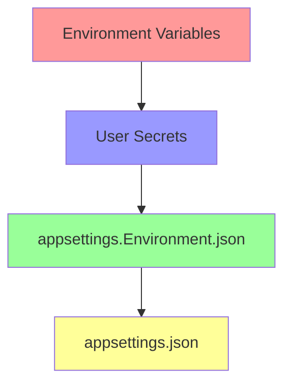
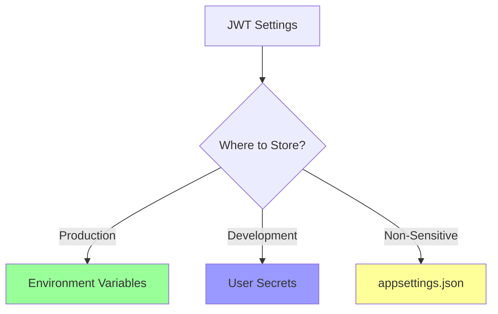

# ASP.NET Core Configuration Guide

## Table of Contents
- [Overview](#overview)
- [Configuration Files](#configuration-files)
- [Environment-Based Configuration](#environment-based-configuration)
- [Accessing Configuration Values](#accessing-configuration-values)
- [Implementation Example](#implementation-example)

## Overview

ASP.NET Core uses a flexible configuration system based on key-value pairs. These configurations can be loaded from multiple sources and can be environment-specific.

## Configuration Files

| File Name | Purpose | Environment |
|-----------|---------|-------------|
| appsettings.json | Base configuration file with default settings | All |
| appsettings.Development.json | Development-specific settings | Development |
| appsettings.Staging.json | Staging-specific settings | Staging |
| appsettings.Production.json | Production-specific settings | Production |

### Common Configuration Settings
- Connection Strings
- Logging Levels
- Application-specific settings
- Third-party service configurations

```json
{
    "ConnectionStrings": {
        "DefaultConnection": "Server=...;Database=...;"
    },
    "Logging": {
        "LogLevel": {
            "Default": "Information"
        }
    },
    "MyKey": "MyValue"
}
```

## Environment-Based Configuration


### Environment Detection
- Located in `Properties/launchSettings.json`
- Controlled by `ASPNETCORE_ENVIRONMENT` variable
- Common values:
  - Development
  - Staging
  - Production

## Accessing Configuration Values

### Using IConfiguration Interface

```csharp
// Basic injection
private readonly IConfiguration _configuration;

public MyClass(IConfiguration configuration)
{
    _configuration = configuration;
}
```

### Reading Configuration Values

| Access Method | Example | Use Case |
|--------------|---------|----------|
| Direct Access | `_configuration["MyKey"]` | Simple key-value |
| Nested Access | `_configuration["ConnectionStrings:DefaultConnection"]` | Nested objects |
| Helper Method | `_configuration.GetConnectionString("DefaultConnection")` | Connection strings |

### Configuration Access Examples

```csharp
// Simple value
var simpleValue = _configuration["MyKey"];

// Nested value
var logLevel = _configuration["Logging:LogLevel:Default"];

// Connection string
var connString = _configuration.GetConnectionString("DefaultConnection");
```

## Implementation Example

```csharp
[Route("[controller]")]
[ApiController]
public class AuthController : ControllerBase
{
    private readonly IAuthService _authService;
    private readonly IConfiguration _configuration;

    public AuthController(IAuthService authService, IConfiguration configuration)
    {
        _authService = authService;
        _configuration = configuration;
    }

    [HttpGet("Test")]
    public IActionResult Test()
    {
        var config = new
        {
            MyKey = _configuration["MyKey"]
        };
        return Ok(config);
    }

    [HttpPost("")]
    public async Task<IActionResult> LoginAsync(
        LoginRequest request, 
        CancellationToken cancellationToken)
    {
        var authResult = await _authService.GetTokenAsync(
            request.Email,
            request.Password,
            cancellationToken);

        return authResult is null 
            ? BadRequest("Invalid Email or Password") 
            : Ok(authResult);
    }
}
```

## Best Practices

1. **Environment-Specific Settings**
   - Keep sensitive data in environment-specific files
   - Use different connection strings per environment
   - Override settings as needed for each environment

2. **Configuration Organization**
   - Group related settings together
   - Use meaningful section names
   - Keep consistent naming conventions

3. **Security Considerations**
   - Never commit sensitive data to source control
   - Use user secrets in development
   - Use secure configuration providers in production

---

This guide provides a comprehensive overview of ASP.NET Core configuration system. For more detailed information, refer to the official Microsoft documentation.


# ASP.NET Core Environment Variables and Configuration Sources

## Configuration Hierarchy


## Environment Variables Sources

| Source | Purpose | Deployment Stage |
|--------|---------|-----------------|
| launchSettings.json | Development environment settings | Development only |
| System Environment Variables | Machine-level settings | All environments |
| Host Environment Variables | Hosting platform settings | Production |

## Accessing Environment Variables

### Example Controller Endpoint
```csharp
[HttpGet("Test")]
public IActionResult Test()
{
    var config = new 
    {
        MyKey = _configuration["ConnectionStrings:DefaultConnection"],
        LogLevel = _configuration["Logging:LogLevel:Default"],
        Env = _configuration["ASPNETCORE_ENVIRONMENT"],
        OneDrive = _configuration["OneDrive"]  // System environment variable
    };
    return Ok(config);
}
```

## Configuration Value Resolution

1. **System Environment Variables**
   - Highest priority
   - Set through Windows System Properties or server configuration
   - Persists across application restarts
   - Example: `OneDrive`, `PATH`, etc.

2. **Launch Settings Environment Variables**
   - Located in `Properties/launchSettings.json`
   - Only available during development
   - Not included in production deployment
   - Example: `ASPNETCORE_ENVIRONMENT`

3. **appsettings.{Environment}.json**
   - Environment-specific settings
   - Overrides base settings
   - Example: `appsettings.Development.json`

4. **appsettings.json**
   - Base configuration
   - Lowest priority
   - Default values for all environments

## Important Notes

- Environment variables take precedence over JSON configuration files
- System environment variables require machine restart to take effect
- Launch settings are development-only and not deployed
- Production environments should use system/host environment variables for sensitive data
- Multiple sources can contain the same key, but higher priority sources override lower ones

## Example Value Resolution

| Key | Source | Priority | Value |
|-----|---------|----------|--------|
| ASPNETCORE_ENVIRONMENT | Environment Variable | 1 | "Development" |
| ASPNETCORE_ENVIRONMENT | appsettings.Development.json | 2 | "Development From AppSettings.Dev" |
| ASPNETCORE_ENVIRONMENT | appsettings.json | 3 | "Development From AppSettings" |

In this case, the value from the environment variable would be used.

## Best Practices

1. **Development Environment**
   - Use `launchSettings.json` for development-specific variables
   - Keep sensitive data in user secrets

2. **Production Environment**
   - Use system/host environment variables for sensitive data
   - Avoid storing sensitive information in appsettings files
   - Configure environment variables through deployment platform

3. **Configuration Management**
   - Document all required environment variables
   - Use meaningful naming conventions
   - Keep configuration sources organized and minimal

---

Remember that the configuration system is hierarchical and flexible, allowing you to override settings based on your environment needs while maintaining security best practices.


# ASP.NET Core User Secrets and Secure Configuration

## Configuration Priority (Highest to Lowest)


## User Secrets Overview

### What are User Secrets?
- Development-only configuration system
- Stores sensitive data outside of project tree
- Not included in source control
- Only available during local development

### Key Features
| Feature | Description |
|---------|-------------|
| Location | Outside project directory |
| Source Control | Not tracked |
| Deployment | Not included in publish |
| Usage | Development environment only |
| File Format | JSON (secrets.json) |

## Setting Up User Secrets

1. **Enable User Secrets**
   - Right-click project in Solution Explorer
   - Select "Manage User Secrets"
   - Creates secrets.json file
   - Adds UserSecretsId to .csproj:
   ```xml
   <UserSecretsId>guid-here</UserSecretsId>
   ```

2. **secrets.json Structure**
   ```json
   {
     "MyKey": "My Value from secrets",
     "ASPNETCORE_ENVIRONMENT": "Development From secrets"
   }
   ```

## Security Considerations

### Development
| Storage Method | Use Case | Security Level |
|---------------|----------|----------------|
| User Secrets | Sensitive data during development | High (local only) |
| launchSettings.json | Development environment settings | Low (can be committed) |

### Production
| Storage Method | Use Case | Security Level |
|---------------|----------|----------------|
| Environment Variables | Sensitive production data | High |
| App Settings | Non-sensitive configuration | Medium |

## Best Practices

1. **Source Control Safety**
   - Never commit sensitive data to source control
   - Use .gitignore to exclude sensitive files
   - Keep secrets.json isolated from project directory

2. **Production Security**
   - Use environment variables for sensitive production data
   - Configure secrets through hosting platform
   - Validate security settings before deployment

3. **Development Workflow**
   - Use user secrets for local development
   - Document required secrets in README
   - Share secrets securely with team members

## Example Configuration Access

```csharp
[HttpGet("Test")]
public IActionResult Test()
{
    var config = new 
    {
        // Will read based on priority:
        // 1. Environment Variables
        // 2. User Secrets
        // 3. appsettings.{Environment}.json
        // 4. appsettings.json
        MyKey = _configuration["MyKey"],
        Environment = _configuration["ASPNETCORE_ENVIRONMENT"]
    };
    return Ok(config);
}
```

## Configuration Sources Summary

| Source | Priority | Development | Production | Source Control |
|--------|----------|-------------|------------|----------------|
| Environment Variables | 1 | ✓ | ✓ | ✗ |
| User Secrets | 2 | ✓ | ✗ | ✗ |
| appsettings.{Environment}.json | 3 | ✓ | ✓ | ✓ |
| appsettings.json | 4 | ✓ | ✓ | ✓ |

## Important Notes
- User secrets are for development only
- Production environments should use secure configuration methods
- Different hosting platforms may provide their own secrets management
- Regular security audits of configuration sources is recommended

---

Remember: Security of sensitive data is crucial. Always use appropriate security measures for your application's environment and requirements.


# JWT Configuration in ASP.NET Core

## Overview
When implementing JWT authentication, it's crucial to manage sensitive configuration data securely. This guide explains how to move JWT settings from hardcoded values to configuration files.

## Configuration Structure

### appsettings.json
```json
{
  "Jwt": {
    "Key": "",  // Keep empty in source control
    "Issuer": "SurveyBasketApp",
    "Audience": "SurveyBasketApp users",
    "ExpiryMinutes": "30"
  }
}
```

### secrets.json (Development)
```json
{
  "Jwt:Key": "J7MfAb4WcAIMkkigVtIepIILOVJEjAcB"
}
```

## Implementation

### Before (Hardcoded Values)
```csharp
private static IServiceCollection AddAuthConfig(this IServiceCollection services)
{
    services.AddAuthentication(/*...*/)
        .AddJwtBearer(o =>
        {
            o.TokenValidationParameters = new TokenValidationParameters
            {
                IssuerSigningKey = new SymmetricSecurityKey(
                    Encoding.UTF8.GetBytes("J7MfAb4WcAIMkkigVtIepIILOVJEjAcB")),
                ValidIssuer = "SurveyBasketApp",
                ValidAudience = "SurveyBasketApp users",
                // ... other parameters
            };
        });
}
```

### After (Configuration-based)
```csharp
private static IServiceCollection AddAuthConfig(
    this IServiceCollection services, 
    IConfiguration configuration)
{
    services.AddSingleton<IJwtProvider, JwtProvider>();
    
    services.AddIdentity<ApplicationUser, IdentityRole>()
            .AddEntityFrameworkStores<ApplicationDbContext>();

    services.AddAuthentication(options => 
    {
        options.DefaultAuthenticateScheme = JwtBearerDefaults.AuthenticationScheme;
        options.DefaultChallengeScheme = JwtBearerDefaults.AuthenticationScheme;
    })
    .AddJwtBearer(o =>
    {
        o.SaveToken = true;
        o.TokenValidationParameters = new TokenValidationParameters
        {
            ValidateIssuerSigningKey = true,
            ValidateIssuer = true,
            ValidateAudience = true,
            ValidateLifetime = true,
            IssuerSigningKey = new SymmetricSecurityKey(
                Encoding.UTF8.GetBytes(configuration["Jwt:Key"]!)),
            ValidIssuer = configuration["Jwt:Issuer"],
            ValidAudience = configuration["Jwt:Audience"]
        };
    });

    return services;
}
```

## Security Considerations



### Sensitive Data Storage

| Environment | Storage Location | Security Level |
|-------------|-----------------|----------------|
| Development | secrets.json | High (local only) |
| Production | Environment Variables | High |
| Source Control | appsettings.json (no secrets) | Safe |

## Best Practices

1. **Secret Management**
   - Never commit JWT keys to source control
   - Use different keys for different environments
   - Rotate keys periodically

2. **Configuration Structure**
   - Organize JWT settings in a dedicated section
   - Use strong, unique keys for each environment
   - Keep non-sensitive defaults in appsettings.json

3. **Development Workflow**
   - Use user secrets for local development
   - Document required JWT configuration
   - Validate all JWT settings on startup

## Setup Steps

1. **Add JWT Configuration Section**
   - Create JWT section in appsettings.json
   - Leave sensitive values empty

2. **Configure User Secrets**
   - Right-click project → Manage User Secrets
   - Add JWT key to secrets.json

3. **Update Service Configuration**
   - Modify AddAuthConfig to accept IConfiguration
   - Replace hardcoded values with configuration
   - Pass configuration in Program.cs

## Common Issues and Solutions

| Issue | Solution |
|-------|----------|
| Missing JWT Key | Validate configuration on startup |
| Invalid Token | Double-check issuer and audience values |
| Token Not Validated | Ensure ValidateIssuerSigningKey is true |

---

Remember: JWT configuration involves sensitive security settings. Always follow security best practices and never expose secrets in your source code or source control.
